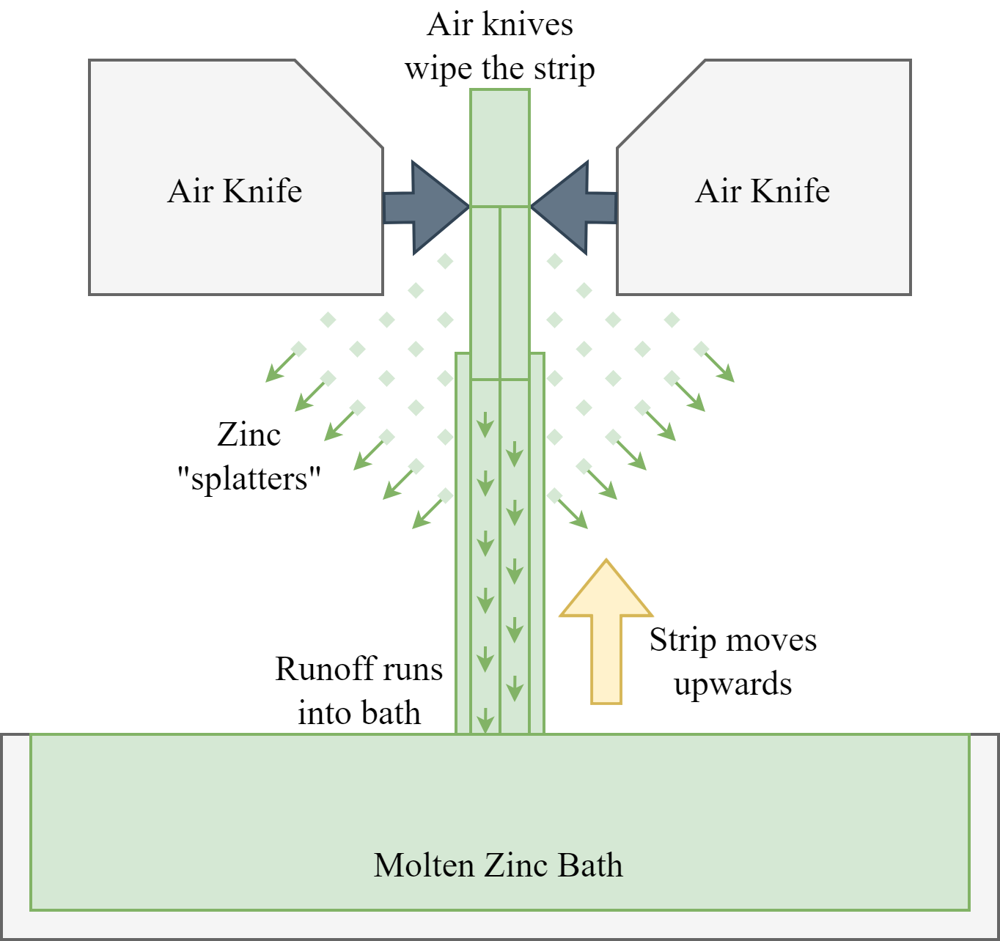

# Splatter Severity Measurement


# Background
During the galvanisation of steel, one crucial step involves submerging preheated steel strip into a bath of molten zinc. This step causes a zinc-iron alloy to form on the surface of the steel which significantly enhances corrosion resistance of the material. To ensure uniform thickness coating, a pair of air knives are used which wipe off excess zinc after submersion. Ideally, the excess zinc flows smoothly down the strip and into the bath, but at high strip speeds where productivity is maximised, zinc detaches from the strip surface and sprays onto the surrounding equipment. This effect is described as zinc splatter. This means that zinc accumulates on the air knives, the electromagnetic stabilisation system and the strip itself, causing equipment degradation which leads to downtime, as well as surface defects which worsen material and energy wastage. Various process parameters such as air knife distance and air pressure affect the splatter severity and currently, severity is visually inspected by operators. This has many inherent limitations such as subjectivity, difficulties recognising splatter occurrence, and the requirement for manual effort for a single judgement. These limitations could be overcome if the splatter severity were to be measured objectively and automatically, which is the aim of this study. By achieving this, the process can be optimised for minimal splatter at high strip speeds which will lead to reduced equipment downtime and improved product quality.

The source code in this repository accompanies research conducted as part of Case Study 2: Splatter Severity Measurement.



# Acknowledgements

**YOLOv5**
Copyright (c) 2023 Ultralytics LLC. 
Licensed under the GNU General Public License v3.0 
Developed by Ultralytics

# Setup
## Customisation (Optional)

 - To customise the model, edit ```knifeSplatter_Final_Deployment.py ```
 - To customise the API, edit ```fastAPI.py```

## Build Docker Container (Tested on Windows PC)
If customised, with Docker installed, rebuild the Docker image by opening command prompt and executing:

	```docker tag imageName:latest dockerName/imageName:latest```

where imageName is arbitrary and dockerName is the Docker username of the user.
## Push Docker Container (Tested on Windows PC)

If customised, execute:

```docker push dockerName/imageName:latest```

to push the image.

## Pull Docker Container (NVIDIA Jetson Orin Nano)

Once the image has been pushed successfully, from the Jetson Orin Nano terminal, execute:

```sudo docker pull callum2310/my_image:latest``` or ```sudo docker pull dockerName/imageName:latest```
   
depending on whether the image has been customised or not.
## Run Docker Container (NVIDIA Jetson Orin Nano)

Once the image has successfully been pulled from DockerHub to the Jetson Orin Nano, to run the container, execute the following on the Nano:

```sudo docker run -it --runtime nvidia -p 8000:8000 callum2310/my_image:latest``` 

(or the customised alternative).

## Get IP  Address (NVIDIA Jetson Orin Nano)
To find the IP address that the client will connect to:

 1. Open a new terminal tab and type ```ifconfig```. 
 2. Find the ```inet``` IP address of ```wlan0``` and save it somewhere for the next step.

## Stream Video (Client Device)

Once the container is running on the Jetson Orin Nano, open ```clientside2.py``` on the client device and edit the line:

```cap = cv2.VideoCapture(r'C:\Users\Callum\Downloads\splatter2023\splatter1.mp4')``` 

either to a desired video file path, or to '0' for live camera stream.


Next, change the IP address in:

```uri = "ws://192.168.1.113:8000/video"``` 

to the IP address of the Nano.

Finally, open command prompt on the client device and execute the following:

```python clientSide2.py```

# Example Results (currently blocked for confidentiality)

Example video outputs are included in this repository and are as follows:

 - **splatter1_processed.mp4:** Model results on Video 1
 
 - **splatter7_processed.mp4:** Model results on Video 7
 

# Code Quality and Contribution Guidelines
The source code in this repository accompanies research conducted as part of Case Study 2: Splatter Severity Measurement. 

It is important to note that this project was initiated with a background in mechanical engineering rather than computer science or software engineering. 

Therefore, the focus is on application of these technologies rather than in software engineering principles. 

The code is shared for collaboration and contribution purposes, and whilst every effort has been made to ensure quality and readability, it may not adhere to all conventions of software development. 

Feedback is welcome, with the understanding that the primary aim is to facilitate further research and application in the field, 
rather than to serve as a benchmark for software engineering excellence. 

# Publication

A paper has been published on this work in the Journal of Intelligent Manufacturing Systems, and is available at: [https://doi.org/xxxxxx](https://doi.org/xxxxxx)

